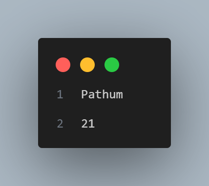

# 🎯 Abstraction and Constructors in Java

> A comprehensive guide to understanding abstraction, encapsulation, constructors, and method overloading in Java Object-Oriented Programming

---

## 📖 Table of Contents

- [Introduction](#-introduction)
- [Understanding Abstraction](#-understanding-abstraction)
- [Objects and Classes in Real World](#-objects-and-classes-in-the-real-world)
- [Properties and Attributes](#-properties-and-attributes)
- [Implementing Classes in Java](#-implementing-classes-in-java)
- [Memory Allocation and Object Creation](#-memory-allocation-and-object-creation)
- [Access Modifiers](#-access-modifiers)
- [Getters and Setters](#-getters-and-setters-encapsulation)
- [Method Overloading](#-method-overloading)
- [Constructors in Java](#-constructors-in-java)
- [References](#-references)

---

## 🌟 Introduction

Object-Oriented Programming (OOP) is built on several fundamental concepts that help us model real-world entities in code. This guide explores two critical aspects of Java OOP:

1. **Abstraction** - Simplifying complex systems by focusing on essential characteristics
2. **Constructors** - Special methods for initializing objects efficiently

Understanding these concepts is essential for writing clean, maintainable, and professional Java code.

---

## 🔍 Understanding Abstraction

### What is Abstraction?

Abstraction is a fundamental concept in Java that focuses on hiding implementation details and showing only essential features to the user. It's the process of removing unnecessary characteristics to reduce something to a set of essential characteristics needed for a particular system.

### Formal Definition

> **Abstraction** denotes the essential characteristics of an object that distinguish it from all other kinds of objects and thus provide crisply defined conceptual boundaries, relative to the perspective of the viewer.
> 
> *(Reference: Grady Booch et al., Object Oriented Analysis and Design with Applications, 3rd Edition, pg 44)*

### Real-World Examples of Abstraction

#### 📺 TV Remote Control Example

A TV remote control is an excellent example of abstraction - it simplifies interaction by hiding complex technology. You don't need to understand how the TV works internally; you just press buttons to change channels or adjust volume.

**What you see (Abstract interface):**
- Power button
- Channel buttons
- Volume controls

**What is hidden (Implementation details):**
- Circuit board operations
- Signal transmission protocols
- Internal processing logic

#### ☕ Coffee Machine Example

Making coffee with a coffee machine demonstrates abstraction - you need to know how to use the machine but not how it works internally. You provide water and coffee beans, switch it on, and select the coffee type.

### Why is Abstraction Important?

Abstraction serves several key purposes in Java programming:

| Benefit | Description |
|---------|-------------|
| **Simplification** | Breaks down complex systems into manageable parts |
| **Code Reusability** | Promotes reusable components across applications |
| **Enhanced Security** | Hides implementation details and protects sensitive information |
| **Reduced Complexity** | Focuses on what an object does rather than how it does it |
| **Better Maintenance** | Changes to implementation don't affect code using the abstraction |

### Types of Abstraction in OOP

#### 1️⃣ Data Abstraction

Data abstraction involves creating complex data types and hiding their implementation, exposing only operations to manipulate them. The implementation can change without affecting the exposed behavior.

#### 2️⃣ Control Abstraction

Control abstraction collects control statements into units and exposes them as single operations. This is fundamental in structured programming.

---

## 🌍 Objects and Classes in the Real World

### Identifying Objects

In OOP, we start by identifying the **objects** (entities) needed in our system. Objects represent real-world things with:
- **State** (properties/attributes)
- **Behavior** (methods/functions)

### Grouping Objects into Classes

Once objects are identified, we **group similar objects** that share common properties and behaviors into **classes**.

**Example: University System**

| Real-World Entities | Class Name |
|---------------------|------------|
| Dr. Pradeepa, Dushantha, Thamali, Dr. Nirosha, Lalani | `Teacher` |
| Theja, Students | `Student` |
| Introduction to Programming, Database Management, Mathematics, English | `Course` |

### Class-Object Relationship

| Concept | Description | Example |
|---------|-------------|---------|
| **Class** | A blueprint or template that defines structure and behavior | `Student` class |
| **Object** | A specific instance of a class with its own data | `student1`, `student2` |
| **Distinction** | Classes define "what", objects are "instances" | Multiple students created from `Student` class |

**Visual Analogy:**
- **Class** = Cookie cutter (template)
- **Objects** = Individual cookies made from that cutter

---

## 📋 Properties and Attributes

### What are Properties?

A class has a set of **properties** (also called **attributes** or **fields**) that describe the characteristics of its objects.

### Example: Student Class Properties

When designing a `Student` class, we need to determine what information describes a student:

- Student ID
- Name
- Batch
- Mobile Number
- Address
- Current Year
- Current Semester

### Context-Dependent Properties

**Important:** The properties you choose depend on the **system's purpose** (this is abstraction in action!).

#### Example: Employee Class

**For a Payroll System:**
- Employee ID
- Name
- Salary
- Bank Account
- Working Hours

**For an Insurance Scheme System:**
- Employee ID
- Name
- Date of Birth
- Health Conditions
- Dependents
- Emergency Contact

**Key Insight:** Same entity (Employee), different properties based on system requirements - this demonstrates **abstraction** selecting only relevant characteristics.

---

## 💻 Implementing Classes in Java

### 🧩 Step 01: Define a Class (Blueprint or Mold)

```java
public class ClassName {
    // attributes and methods go here
}
```

- Attributes are variables that belong to a class or an object.

### 🧩 Step 02: Create an Object (Dynamic Instance)

Use the `new` keyword to create an object in method:

```java
ClassName objectName = new ClassName();
```

### 🧩 Step 03: Create Attributes in the Class

Define variables (properties) inside the class.

```java
public class ClassName {
    AttributeType attributeName;
}
```

### 🧩 Step 04: Initialize Object Properties

Assign values to object attributes in method:

```java
objectName.attributeName = "Value";
```

### 📘 How to Use Objects in Java

In Java, once you have created an object, you can interact with it in two main ways: accessing its properties (attributes) and calling its methods (functions).

#### 1️⃣ Access Object Properties

Use the dot operator (`.`) to access the attributes of an object.

```java
objectName.attributeName
```

#### 2️⃣ Call Object Methods

Use the dot operator (`.`) to call methods defined in the class.

```java
objectName.methodName();
```

[](AttributesAndClassesSample.java)

**Output:**


---

## 🔧 Memory Allocation and Object Creation

### How Java Creates Objects

When you create an object in Java, memory is allocated in two areas:

#### 1. **Stack Memory**
- Stores **reference variables** (object names)
- Fast access
- Automatically managed

#### 2. **Heap Memory**
- Stores **actual objects** (data and methods)
- Dynamically allocated
- Managed by Garbage Collector

### Object Creation Syntax

```java
// Declare and create object
ClassName objectName = new ClassName();

// Or in two steps:
ClassName objectName;           // Declaration (Stack)
objectName = new ClassName();   // Instantiation (Heap)
```

### Memory Diagram

```
Stack Memory              Heap Memory
+----------------+       +------------------------+
| rect1 (ref) ---+------>| Rectangle Object       |
+----------------+       | - length: 0.0          |
                         | - width: 0.0           |
                         | - methods              |
                         +------------------------+
```

### Multiple Objects

Each object created has its own memory space in the heap and maintains independent state:

```java
Rectangle rect1 = new Rectangle();
Rectangle rect2 = new Rectangle();
Rectangle rect3 = new Rectangle();
```

**Result:** Three separate objects in heap memory, each with its own state.

---

## 🔐 Access Modifiers

Access modifiers in Java control the visibility and accessibility of classes, methods, and attributes.

### Types of Access Modifiers

| Modifier | Class | Package | Subclass | World | Use Case |
|----------|-------|---------|----------|-------|----------|
| `public` | ✅ | ✅ | ✅ | ✅ | Accessible everywhere |
| `protected` | ✅ | ✅ | ✅ | ❌ | Accessible in package and subclasses |
| `default` | ✅ | ✅ | ❌ | ❌ | Accessible only in package (no keyword) |
| `private` | ✅ | ❌ | ❌ | ❌ | Accessible only in same class |

### Syntax Usage

```java
public class Employee {
    private double salary;              // Private attribute
    public String getName() { }         // Public method
    protected void calculateBonus() { } // Protected method
    void internalMethod() { }           // Default access
}
```

### Best Practice

**Golden Rule:** 
- Make attributes `private` by default
- Provide `public` methods (getters/setters) for controlled access
- This ensures **encapsulation** and **data security**

---

## 🛡️ Getters and Setters (Encapsulation)

### Why Use Getters and Setters?

All properties of a class should have **restricted access** (declared as `private`) to ensure encapsulation and data security. These properties can only be accessed or modified from outside the class through **public methods**.

### Benefits of Getters and Setters

| Benefit | Description |
|---------|-------------|
| **Data Validation** | Check values before assignment |
| **Controlled Access** | Decide which properties can be read/written |
| **Flexibility** | Change internal implementation without affecting external code |
| **Debugging** | Add logging or breakpoints easily |
| **Read-Only/Write-Only** | Create properties that can only be read or written |

---

### Setters (Mutators)

**Purpose:** Public methods used to set or update values of private attributes.

#### Setter Syntax

```java
public void setVariableName(DataType variableName) {
    this.variableName = variableName;
}
```

#### Setter with Validation Syntax

```java
public void setVariableName(DataType variableName) {
    if (validationCondition) {
        this.variableName = variableName;
    } else {
        // Handle invalid input
    }
}
```

---

### Getters (Accessors)

**Purpose:** Public methods used to retrieve values of private properties.

#### Getter Syntax

```java
public DataType getVariableName() {
    return variableName;
}
```

[](SettersAndGettersSampleCode/src)

**Output:**



---

### Understanding the `this` Keyword

The `this` keyword refers to the current object instance.

| Usage | Purpose | Syntax |
|-------|---------|--------|
| `this.variable` | Access instance variable | `this.name = name;` |
| `this()` | Call another constructor | `this(0, "Unknown");` |
| `this.method()` | Call method in same class | `this.calculateTotal();` |
| `this` | Pass current object | `return this;` |

#### Common Use: Distinguishing Parameters from Instance Variables

```java
public void setName(String name) {
    this.name = name;  // 'this.name' = instance variable
                       // 'name' = parameter
}
```

---

## 🔄 Method Overloading

### What is Method Overloading?

Method overloading in Java allows multiple methods in the same class to have the same name but different parameter lists. This is a form of **compile-time polymorphism**.

### Rules for Method Overloading

For valid method overloading:

1. ✅ Methods **must** have the same name
2. ✅ Methods **must** differ in:
   - Number of parameters, OR
   - Type of parameters, OR
   - Order of parameters
3. ❌ Return type alone **does not** affect overloading

### Why Use Method Overloading?

**Benefits:**

| Benefit | Description |
|---------|-------------|
| **Code Readability** | One intuitive method name for similar operations |
| **Flexibility** | Multiple ways to call the same operation |
| **Convenience** | Users don't need to remember multiple method names |
| **Polymorphism** | Implements compile-time polymorphism |

---

### Types of Method Overloading

#### 1️⃣ By Number of Parameters

**Syntax:**

```java
public class Calculator {
    public int add(int a, int b) { }
    public int add(int a, int b, int c) { }
    public int add(int a, int b, int c, int d) { }
}
```

---

#### 2️⃣ By Type of Parameters

**Syntax:**

```java
public class Display {
    public void show(int number) { }
    public void show(double number) { }
    public void show(String text) { }
}
```

---

#### 3️⃣ By Order of Parameters

**Syntax:**

```java
public class DataProcessor {
    public void process(String name, int age) { }
    public void process(int age, String name) { }
}
```

---

### Invalid Method Overloading

```java
// ❌ INVALID: Only return type is different
public int calculate(int a, int b) { }
public double calculate(int a, int b) { }  // Compilation Error!

// ❌ INVALID: Only parameter names are different
public void display(int number) { }
public void display(int value) { }  // Compilation Error!
```

[](MethodOverloadingSample.java)

**Output:**


---

## 🏗️ Constructors in Java

### What is a Constructor?

A **constructor** is a special method used to initialize objects. It is called automatically when an object is created using the `new` keyword.

### Constructor Characteristics

| Characteristic | Description |
|----------------|-------------|
| **Name** | Must be the same as the class name |
| **No Return Type** | Not even `void` |
| **Automatic Invocation** | Called automatically during object creation |
| **Purpose** | Initialize object attributes to desired values |
| **Types** | Default and Parameterized (Overloaded) |

---

### Why Do We Need Constructors?

**Key Benefits:**
- Automatic initialization of objects
- Ensures objects are always in a valid state
- Reduces code duplication
- Makes object creation cleaner and more intuitive

**Comparison:**

| Without Constructor | With Constructor |
|---------------------|------------------|
| Create object, then set each property manually | Create object with all properties initialized |
| Multiple lines of code | Single line of code |
| Risk of forgetting initialization | Guaranteed initialization |

---

### Default Constructor

A default constructor is a constructor that does not take any arguments. It initializes attributes to default values.

#### Automatic Default Constructor

If you don't define any constructor, Java automatically provides a default constructor that initializes objects with default values:

- **Objects:** `null`
- **Integers:** `0`
- **Floating-point:** `0.0`
- **Booleans:** `false`

#### User-Defined Default Constructor Syntax

```java
public class ClassName {
    private DataType attribute;
    
    // Default constructor
    public ClassName() {
        attribute = defaultValue;
    }
}
```

---

### Parameterized Constructors (Overloaded Constructors)

Overloaded constructors allow a class to have multiple constructors with different parameter lists, providing flexibility in object creation.

#### Why Use Parameterized Constructors?

**Benefits:**
1. Initialize objects with specific values immediately
2. Provide multiple initialization options
3. Reduce code by avoiding setters for initial values
4. Ensure required data is provided at creation time

---

### Constructor Overloading Syntax

```java
public class Employee {
    private int employeeId;
    private String name;
    private double salary;
    
    // Default Constructor
    public Employee() {
        this.employeeId = 0;
        this.name = "Not Assigned";
        this.salary = 0.0;
    }
    
    // Constructor with 2 parameters
    public Employee(int employeeId, String name) {
        this.employeeId = employeeId;
        this.name = name;
        this.salary = 0.0;
    }
    
    // Constructor with all parameters
    public Employee(int employeeId, String name, double salary) {
        this.employeeId = employeeId;
        this.name = name;
        this.salary = salary;
    }
}
```

---

### Constructor Chaining with `this()`

You can use `this()` to call one constructor from another constructor in the same class. This reduces code duplication.

**Important Rules:**
- `this()` must be the **first statement** in the constructor
- Cannot create circular constructor calls

#### Constructor Chaining Syntax

```java
public class Product {
    private int productId;
    private String name;
    private double price;
    
    // Most comprehensive constructor
    public Product(int productId, String name, double price) {
        this.productId = productId;
        this.name = name;
        this.price = price;
    }
    
    // Calls the 3-parameter constructor with default price
    public Product(int productId, String name) {
        this(productId, name, 0.0);
    }
    
    // Calls the 3-parameter constructor with default values
    public Product() {
        this(0, "Unknown", 0.0);
    }
}
```

**Benefits of Constructor Chaining:**
- Reduces code duplication
- Central initialization logic
- Easier to maintain
- Ensures consistency

---

### Important Constructor Rules

| Rule | Description |
|------|-------------|
| **Same Name** | Constructor name must match class name exactly |
| **No Return Type** | Constructors don't have return types (not even `void`) |
| **Automatic Call** | Called automatically when object is created with `new` |
| **First Statement** | `this()` or `super()` must be first statement if used |
| **Overloading** | Can have multiple constructors with different parameters |
| **No Default if Defined** | If you define any constructor, Java won't provide default constructor |

[](ConstructorsSample.java)

**Output:**


---

### Key Concepts Learned

| Concept | Description | Importance |
|---------|-------------|------------|
| **Abstraction** | Hiding complexity and showing only essential features | Simplifies design and improves maintainability |
| **Objects & Classes** | Blueprint (class) and instances (objects) relationship | Foundation of OOP |
| **Properties** | Attributes that define object state | Data representation |
| **Access Modifiers** | Control visibility of class members | Security and encapsulation |
| **Getters & Setters** | Controlled access to private attributes | Data protection and validation |
| **Method Overloading** | Multiple methods with same name, different parameters | Code flexibility and readability |
| **Constructors** | Special methods for object initialization | Automatic and consistent initialization |

### Principles to Remember

✅ Use **abstraction** to focus on essential characteristics  
✅ Apply **encapsulation** with private attributes and public methods  
✅ Implement **getters and setters** for controlled access  
✅ Provide **multiple constructors** for flexible object creation  
✅ Use **method overloading** to improve code readability  
✅ Always **validate input** in setters and constructors  
✅ Follow **naming conventions** for better code clarity  

---

## 📚 References

1. **Booch, G., Maksimchuk, R. A., Engle, M. W., Young, B. J., Conallen, J., & Houston, K. A.** (2008). *Object-Oriented Analysis and Design with Applications* (3rd ed.). Addison-Wesley Professional.

2. **Oracle Java Documentation** - Java Tutorials: Classes and Objects. Retrieved from https://docs.oracle.com/javase/tutorial/java/javaOO/

3. **Bloch, J.** (2018). *Effective Java* (3rd ed.). Addison-Wesley Professional.

4. **Horstmann, C. S.** (2019). *Core Java Volume I - Fundamentals* (11th ed.). Prentice Hall.

5. **Schildt, H.** (2021). *Java: The Complete Reference* (12th ed.). McGraw-Hill Education.

6. **GeeksforGeeks** - Object Oriented Programming in Java. Retrieved from https://www.geeksforgeeks.org/object-oriented-programming-oops-concept-in-java/

7. **Tutorialspoint** - Java Object and Classes. Retrieved from https://www.tutorialspoint.com/java/java_object_classes.htm

8. **SLIIT Faculty of Computing** - SE1020 Object-Oriented Programming Lecture Slides, Lecture 02: Abstraction and Constructors.

---

<p align="center">
  <strong>Happy Learning! ☕</strong><br>
</p>


